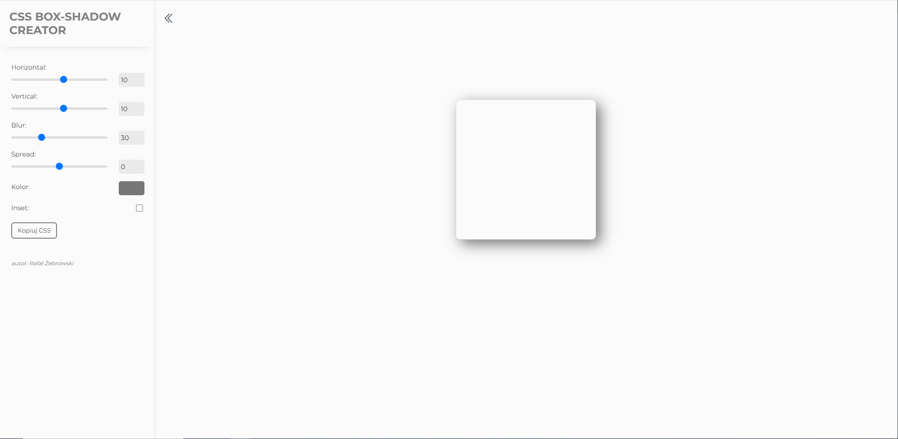

## CSS BOX-SHADOW CREATOR

Narzędzie, dzięki któremu wygodnie wygenerujesz gotowe reguły CSS, dostowując box-shadow i kopiując gotowy kod.

### Demo

http://rafal-zebrowski.github.io/css-box-shadow-creator